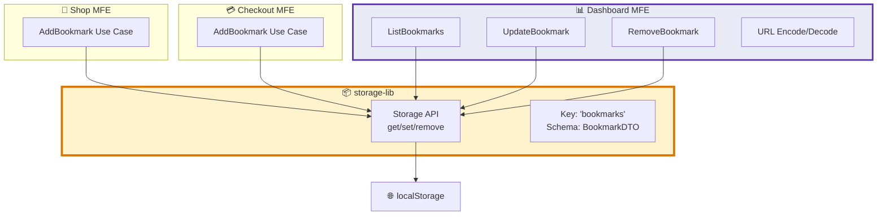

Perfect! Here's the complete `structure.md` content ready to paste:

```markdown
# Dashboard MFE Structure

## Overview

Dashboard MFE provides **management UI** for bookmarks, shortcuts, and future widgets. It uses **Hexagonal Architecture** to keep business logic pure and infrastructure pluggable. Critically, Dashboard is **not** the source of truth—it's a consumer/editor of data that persists independently via `storage-lib` or backend APIs.

---

## Core Architecture: Hexagonal (Ports & Adapters)

```text
apps/
  dashboard/
    src/
      domain/                  # Pure business model (no framework imports)
        entities/
          Bookmark.ts
          Shortcut.ts
        value-objects/
          Url.ts
          KeyBinding.ts
        services/
          BookmarkPolicy.ts
          
      application/             # Use cases; orchestrate domain via ports
        use-cases/
          # Bookmarks
          AddBookmark.ts
          ListBookmarks.ts
          UpdateBookmark.ts
          RemoveBookmark.ts
          BulkRemoveBookmarks.ts
          EncodeBookmarksToUrl.ts
          DecodeUrlToBookmarks.ts
          ImportBookmarks.ts
          ExportBookmarks.ts
          # Future: shortcuts, widgets
        dtos/
          BookmarkDTO.ts
          SharePayload.ts
          
      ports/                   # Interfaces (contracts)
        bookmark-repository.ts
        shortcut-repository.ts
        event-bus.ts
        storage.ts
        
      adapters/
        primary/               # Driving adapters (UI, state, routing)
          ui/
            components/
              BookmarkList.tsx
              BookmarkForm.tsx
              ShareButton.tsx
            pages/
              BookmarksPage.tsx
              DashboardHome.tsx
            state/
              bookmarkStore.ts
          routing/
            routes.tsx
            
        secondary/             # Driven adapters (infrastructure)
          storage/
            LocalStorageBookmarkRepository.ts
          http/
            ApiBookmarkRepository.ts
          events/
            ComLibEventBus.ts
            
      config/
        index.ts
        
      composition-root.ts      # Wire ports ↔ adapters (DI)
      index.tsx
      
    test/
      unit/
        AddBookmark.test.ts
        UpdateBookmark.test.ts
      integration/
        BookmarkRepository.integration.test.ts
        
packages/                      # Shared across all MFEs
  storage-lib/                 # ⭐ Client-side persistence wrapper
    src/
      storage.ts               # localStorage/sessionStorage/IndexedDB API
      contracts/
        BookmarkDTO.ts
        ShortcutDTO.ts
  com-lib/                     # Event bus (if needed)
  shared/
    types/
      index.ts
```

---

## Dependency Rule (The Sacred Law)

**Adapters → Ports → Application → Domain**

- ✅ Adapters (UI, storage, HTTP) can import from Ports
- ✅ Application (use cases) can import from Ports and Domain
- ✅ Ports can import from Domain
- ❌ Domain **never** imports from Application, Ports, or Adapters
- ❌ Application **never** imports from Adapters
- ❌ Ports **never** import from Adapters

---

## Dashboard Responsibilities

### ✅ Dashboard IS Responsible For

1. **Full CRUD on Bookmarks/Shortcuts** (when mounted)
   - Create (manual add via Dashboard UI)
   - Read (display list)
   - Update (edit title, URL, tags)
   - Delete (remove single or bulk)

2. **URL Encoding/Sharing**
   - Encode bookmarks as shareable URL: `/dashboard?share=base64(JSON)`
   - Decode incoming share links and merge/import

3. **Organization & Management**
   - Sorting, filtering, grouping
   - Tagging, categorization
   - Bulk operations

4. **Import/Export**
   - Export as JSON/CSV
   - Import from file or URL

### ❌ Dashboard is NOT Responsible For

- ❌ Being the **only** way to add bookmarks (other MFEs can add directly)
- ❌ Being **mounted** for persistence to work (localStorage is independent)
- ❌ Acting as a **singleton service layer** (that's `storage-lib`)

---

## Cross-MFE Data Flow

### Key Insight

**Other MFEs (Shop, Checkout, etc.) can add bookmarks even when Dashboard isn't loaded.** Dashboard reads from shared `storage-lib` on mount.



---

## Code Examples

### Domain — Entity

```ts
// domain/entities/Bookmark.ts
import { Url } from '../value-objects/Url';

export interface BookmarkProps {
  id: string;
  title: string;
  url: Url;
  createdAt: Date;
  tags?: string[];
}

export class Bookmark {
  constructor(public readonly props: BookmarkProps) {}
}
```

### Domain — Value Object

```ts
// domain/value-objects/Url.ts
export class Url {
  constructor(private readonly value: string) {
    if (!/^https?:\/\//.test(value)) throw new Error('Invalid URL');
  }
  toString() { return this.value; }
}
```

### Application — Use Case (Update)

```ts
// application/use-cases/UpdateBookmark.ts
import { BookmarkRepository } from '../../ports/bookmark-repository';
import { BookmarkDTO } from '../dtos/BookmarkDTO';
import { Bookmark } from '../../domain/entities/Bookmark';
import { Url } from '../../domain/value-objects/Url';

export class UpdateBookmark {
  constructor(private repo: BookmarkRepository) {}
  
  async execute(id: string, updates: Partial<Omit<BookmarkDTO, 'id'>>): Promise<BookmarkDTO> {
    const all = await this.repo.list();
    const target = all.find(b => b.props.id === id);
    
    if (!target) throw new Error(`Bookmark ${id} not found`);
    
    const updated = new Bookmark({
      ...target.props,
      title: updates.title ?? target.props.title,
      url: updates.url ? new Url(updates.url) : target.props.url,
    });
    
    await this.repo.save(updated);
    
    return {
      id: updated.props.id,
      title: updated.props.title,
      url: updated.props.url.toString(),
      createdAt: updated.props.createdAt.toISOString(),
    };
  }
}
```

### Application — Use Case (URL Encoding)

```ts
// application/use-cases/EncodeBookmarksToUrl.ts
import { BookmarkDTO } from '../dtos/BookmarkDTO';

export class EncodeBookmarksToUrl {
  execute(bookmarks: BookmarkDTO[]): string {
    const payload = {
      version: 1,
      bookmarks,
      createdAt: new Date().toISOString(),
    };
    return btoa(JSON.stringify(payload)); // base64
  }
}
```

### Port — Repository Interface

```ts
// ports/bookmark-repository.ts
import { Bookmark } from '../domain/entities/Bookmark';

export interface BookmarkRepository {
  save(b: Bookmark): Promise<void>;
  list(): Promise<Bookmark[]>;
  findById(id: string): Promise<Bookmark | null>;
  remove(id: string): Promise<void>;
  bulkRemove(ids: string[]): Promise<void>;
  replaceAll(bookmarks: Bookmark[]): Promise<void>;
}
```

### Adapter — localStorage Implementation

```ts
// adapters/secondary/storage/LocalStorageBookmarkRepository.ts
import { BookmarkRepository } from '../../../ports/bookmark-repository';
import { Bookmark } from '../../../domain/entities/Bookmark';
import { Url } from '../../../domain/value-objects/Url';
import { storage } from '@packages/storage-lib';

const KEY = 'bookmarks';

export class LocalStorageBookmarkRepository implements BookmarkRepository {
  async save(b: Bookmark): Promise<void> {
    const all = await this.list();
    const filtered = all.filter(x => x.props.id !== b.props.id);
    const updated = [...filtered, b].map(toDTO);
    storage.set(KEY, updated);
  }
  
  async list(): Promise<Bookmark[]> {
    const raw = storage.get<any[]>(KEY) || [];
    return raw.map(r => new Bookmark({
      id: r.id,
      title: r.title,
      url: new Url(r.url),
      createdAt: new Date(r.createdAt),
      tags: r.tags,
    }));
  }
  
  async remove(id: string): Promise<void> {
    const all = await this.list();
    const filtered = all.filter(x => x.props.id !== id).map(toDTO);
    storage.set(KEY, filtered);
  }
  
  async bulkRemove(ids: string[]): Promise<void> {
    const all = await this.list();
    const filtered = all.filter(x => !ids.includes(x.props.id)).map(toDTO);
    storage.set(KEY, filtered);
  }
  
  async replaceAll(bookmarks: Bookmark[]): Promise<void> {
    storage.set(KEY, bookmarks.map(toDTO));
  }
  
  async findById(id: string): Promise<Bookmark | null> {
    const all = await this.list();
    return all.find(b => b.props.id === id) || null;
  }
}

function toDTO(b: Bookmark) {
  return {
    id: b.props.id,
    title: b.props.title,
    url: b.props.url.toString(),
    createdAt: b.props.createdAt.toISOString(),
    tags: b.props.tags,
  };
}
```

### Adapter — UI Component

```tsx
// adapters/primary/ui/components/BookmarkList.tsx
import React from 'react';
import { useBookmarkStore } from '../state/bookmarkStore';

export const BookmarkList: React.FC = () => {
  const { bookmarks, load, remove } = useBookmarkStore();
  
  React.useEffect(() => { load(); }, [load]);
  
  return (
    <ul>
      {bookmarks.map(b => (
        <li key={b.id}>
          <a href={b.url}>{b.title}</a>
          <button onClick={() => remove(b.id)}>Delete</button>
        </li>
      ))}
    </ul>
  );
};
```

### Adapter — State Hook

```tsx
// adapters/primary/ui/state/bookmarkStore.ts
import React from 'react';
import { container } from '../../../../composition-root';
import type { BookmarkDTO } from '../../../../application/dtos/BookmarkDTO';

export function useBookmarkStore() {
  const [bookmarks, setBookmarks] = React.useState<BookmarkDTO[]>([]);
  
  const load = React.useCallback(async () => {
    const list = await container.useCases.listBookmarks.execute();
    setBookmarks(list);
  }, []);
  
  const remove = React.useCallback(async (id: string) => {
    await container.useCases.removeBookmark.execute(id);
    await load();
  }, [load]);
  
  return { bookmarks, load, remove };
}
```

### Composition Root (DI Wiring)

```ts
// composition-root.ts
import { LocalStorageBookmarkRepository } from './adapters/secondary/storage/LocalStorageBookmarkRepository';
import { AddBookmark } from './application/use-cases/AddBookmark';
import { ListBookmarks } from './application/use-cases/ListBookmarks';
import { UpdateBookmark } from './application/use-cases/UpdateBookmark';
import { RemoveBookmark } from './application/use-cases/RemoveBookmark';
import { EncodeBookmarksToUrl } from './application/use-cases/EncodeBookmarksToUrl';
import { DecodeUrlToBookmarks } from './application/use-cases/DecodeUrlToBookmarks';

const repo = new LocalStorageBookmarkRepository();

export const container = {
  ports: { repo },
  useCases: {
    addBookmark: new AddBookmark(repo),
    listBookmarks: new ListBookmarks(repo),
    updateBookmark: new UpdateBookmark(repo),
    removeBookmark: new RemoveBookmark(repo),
    encodeBookmarksToUrl: new EncodeBookmarksToUrl(),
    decodeUrlToBookmarks: new DecodeUrlToBookmarks(),
  },
};
```

### Shared Package — storage-lib

```ts
// packages/storage-lib/src/storage.ts
export const storage = {
  get<T>(key: string): T | null {
    const raw = window.localStorage.getItem(key);
    return raw ? (JSON.parse(raw) as T) : null;
  },
  
  set<T>(key: string, value: T): void {
    window.localStorage.setItem(key, JSON.stringify(value));
  },
  
  remove(key: string): void {
    window.localStorage.removeItem(key);
  },
};
```

### Shared Package — BookmarkDTO Contract

```ts
// packages/storage-lib/src/contracts/BookmarkDTO.ts
export type BookmarkDTO = {
  id: string;
  title: string;
  url: string;
  createdAt: string; // ISO 8601
  tags?: string[];
  source?: string; // Optional: which MFE added it
};
```

---

## Testing Strategy

### Unit Tests (Pure Business Logic)

```ts
// test/unit/UpdateBookmark.test.ts
import { describe, it, expect, vi } from 'vitest';
import { UpdateBookmark } from '../../src/application/use-cases/UpdateBookmark';

const mockRepo = {
  list: vi.fn().mockResolvedValue([
    { props: { id: '1', title: 'Old', url: { toString: () => 'https://a.b' }, createdAt: new Date() } }
  ]),
  save: vi.fn(),
};

describe('UpdateBookmark', () => {
  it('updates title', async () => {
    const uc = new UpdateBookmark(mockRepo as any);
    const result = await uc.execute('1', { title: 'New' });
    expect(result.title).toBe('New');
    expect(mockRepo.save).toHaveBeenCalled();
  });
});
```

### Integration Tests (Real localStorage)

```ts
// test/integration/BookmarkRepository.integration.test.ts
import { describe, it, expect, beforeEach } from 'vitest';
import { LocalStorageBookmarkRepository } from '../../src/adapters/secondary/storage/LocalStorageBookmarkRepository';
import { Bookmark } from '../../src/domain/entities/Bookmark';
import { Url } from '../../src/domain/value-objects/Url';

describe('LocalStorageBookmarkRepository', () => {
  beforeEach(() => localStorage.clear());
  
  it('persists and retrieves bookmarks', async () => {
    const repo = new LocalStorageBookmarkRepository();
    const b = new Bookmark({ id: '1', title: 'Test', url: new Url('https://test.com'), createdAt: new Date() });
    
    await repo.save(b);
    const list = await repo.list();
    
    expect(list).toHaveLength(1);
    expect(list[0].props.title).toBe('Test');
  });
});
```

---

## Contracts & Interoperability

### localStorage Contract

- **Key**: `'bookmarks'`
- **Schema**: `BookmarkDTO[]` (JSON array)
- **Shared by**: All MFEs via `storage-lib`
- **Migration Strategy**: Version field in schema for backward compatibility

### URL Share Format

```
/dashboard?share=BASE64_ENCODED_JSON

Decoded payload:
{
  "version": 1,
  "bookmarks": [BookmarkDTO, ...],
  "createdAt": "2025-11-11T10:00:00Z",
  "source": "user@example.com"
}
```

---

## Implementation Checklist

- [ ] Create `packages/storage-lib` with localStorage wrapper
- [ ] Define `BookmarkDTO` contract in `storage-lib/contracts`
- [ ] Scaffold Dashboard MFE with hexagonal folder structure
- [ ] Implement domain entities (Bookmark, Url)
- [ ] Implement core use cases (Add, List, Update, Remove)
- [ ] Implement URL encode/decode use cases
- [ ] Build LocalStorageBookmarkRepository adapter
- [ ] Build UI components (BookmarkList, BookmarkForm)
- [ ] Wire composition-root.ts
- [ ] Add unit tests for use cases
- [ ] Add integration tests for repository
- [ ] Update Shop/Checkout MFEs to use `storage-lib`
- [ ] Document cross-MFE flow in `cross-mfe-flow.md`

---

## Future Enhancements

- Shortcuts management (similar CRUD flow)
- Widgets system (pluggable dashboard cards)
- Backend sync (replace localStorage adapter with API adapter)
- Real-time sync across tabs (BroadcastChannel API)
- Search/filter bookmarks
- Tag management
- Import from browser bookmarks
- Export to browser bookmarks

---

## References

- [Hexagonal Architecture (Alistair Cockburn)](https://alistair.cockburn.us/hexagonal-architecture/)
- [Ports & Adapters Pattern](https://herbertograca.com/2017/11/16/explicit-architecture-01-ddd-hexagonal-onion-clean-cqrs-how-i-put-it-all-together/)
- `ideas.md` — Technical discussion on Dashboard responsibilities
- `cross-mfe-flow.md` — Detailed sequence diagrams (to be created)

---

**Ready to paste into `dashboard/structure.md`!** This gives you:

1. ✅ Complete folder structure
2. ✅ Dependency rules
3. ✅ Responsibility boundaries
4. ✅ Code examples for every layer
5. ✅ Cross-MFE data flow explanation
6. ✅ Testing strategy
7. ✅ Implementation checklist
8. ✅ Contracts (localStorage + URL encoding)
